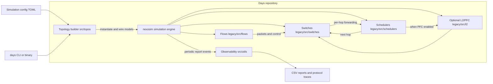

Days is built around a small set of concepts:

- **Discrete-event simulation**: all progression happens by processing scheduled events in timestamp order.
- **Actor model**: each simulated component is an actor that owns its state and communicates via message passing.
- **Packets carry time**: most components avoid querying the global simulation clock by reading the timestamp stored in the message itself.

The legacy engine under `legacy/` uses the `nexosim` crate. Each actor implements `nexosim::model::Model` and receives messages through connected `Output<T>` ports and model mailboxes (`Mailbox<M>`).

## Bird's-eye architecture

The following diagram shows the high-level structure of Days and how the major runtime pieces interact.



## Main components

- **Topology builder** (`src/topos/`): shared graph and configuration parsing; `legacy/src/topos/topo.rs` instantiates and runs Nexosim models.
- **Switch** (`legacy/src/switches/`): `PacketSwitch` demultiplexes packets using a per-flow forwarding table (FIB).
- **Schedulers** (`legacy/src/schedulers/`): model per-port queueing, drop/ECN policies, and transmission delay.
- **Flows** (`legacy/src/flows/`): model sources/sinks (packet distributions, TCP, DCQCN) and collectives.
- **Optional L2** (`legacy/src/l2/`, feature-gated): link-layer frames and PFC (802.1Qbb-style pause).
- **Logging/UI** (`src/utils/`, `legacy/src/utils/ui.rs`): CSV report logging and the legacy progress UI.

## Message flow (L3/L4-only)

When L2 is disabled (default), each network hop looks like:

```
PacketSwitch (upstream) -> Scheduler (per edge) -> PacketSwitch (downstream)
```

For an end-to-end flow, the path is:

```
PacketSource -> (host) PacketSwitch -> [Scheduler+Switch]* -> PacketSink
```

Where:

- the switch chooses the next hop using `fib[flow_id]` for data packets and `r_fib[flow_id]` for reverse traffic (ACKs and control packets),
- the scheduler models queueing + serialization delay and forwards the packet with an updated timestamp.

## Optional L2/PFC pipeline

When `link.mode="Pfc"` and the binary is built with `--features l2_pfc`, each edge becomes a small pipeline:

```
Scheduler -> PfcEgressGate -> Link (serializer) -> PfcIngressPort -> PacketSwitch
```

This keeps the default path lean: when L2 is disabled, none of the extra models exist.

## Reports and observability

Days periodically emits CSV reports (configurable by `report_interval`) for:

- sources (`sources.csv`)
- sinks (`sinks.csv`)
- schedulers (`switches.csv`)
- optional PFC ports (`pfc.csv`)
- optional per-event protocol traces for the Lean checker:
  - `dcqcn_events.csv` (with `--features dcqcn,lean`)
  - `pfc_events.csv` (with `--features l2_pfc,lean`)
  - `cubic_events.csv` (with `--features lean`)
  - `drr_events.csv` (with `--features lean`)
  - `wfq_events.csv` (with `--features lean`)
