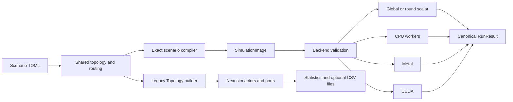

Days has two simulation engines over a shared topology and configuration vocabulary:

- The **exact engine** compiles a scenario into fixed logical-process (LP) state and canonical events, then runs it on scalar, CPU, Metal, or CUDA.
- The **legacy engine** instantiates actor-like Rust models on the vendored Nexosim runtime.

“Actor” refers only to the legacy Nexosim models. Exact hosts and switch egress queues are LPs with explicit owned state; they are not coroutines or mailboxes.

## System map

## Exact engine

`src/scenario/compile.rs` lowers supported configuration into `executor::SimulationImage`. The image contains stable node, link, flow, and packet IDs; one LP for each host and switch egress queue; fixed event payloads; owned protocol state; and channel delay bounds.

Events use integer nanosecond time and a canonical `(time_ns, phase, origin_node, origin_seq)` key. `executor/src/validate.rs` checks the complete image and the selected backend before execution. The global scalar path uses one ordered event calendar. Scalar-round, CPU, Metal, and CUDA use conservative safe-horizon rounds and canonical cross-LP exchange.

See [/docs/architecture/executor-scope](/docs/architecture/executor-scope) for the implemented mechanism and backend matrix.

## Legacy engine

`legacy/src/topos/topo.rs` creates Nexosim models and connects their typed ports and bounded mailboxes. Sources, sinks, switches, schedulers, optional wire/L2 stages, and the UI are stateful actor-like models.

Nexosim owns the authoritative event clock. The legacy boundary converts scenario times and model delays to integer nanoseconds in `legacy/src/utils/exact_time.rs`. `Packet.time` and other `f64` fields remain compatibility, controller, and report views; they are not a separate clock.

Legacy execution can use Nexosim's single-threaded or multithreaded executor. Ready actors at one simulated timestamp may run concurrently, so wall-clock task order is not a protocol guarantee.

## Shared topology, different assembly

`src/topos/build.rs` constructs FatTree, Torus, Dragonfly, or custom graphs and returns both the switch graph and semantic host attachments. The engines consume that shared structure differently:

| Concern | Exact engine | Legacy engine |
| --- | --- | --- |
| Component | Host or switch-egress LP | Nexosim model |
| Communication | Fixed `Event` values and LP outboxes | `Output<T>`, mailboxes, and scheduled handlers |
| Time | `u64` nanoseconds in `EventKey` | `MonotonicTime` with an integer-ns Days boundary |
| Parallel safety | Positive-lookahead safe horizons | Nexosim timestamp stepping and task execution |
| Result | Normalized state and observations | Sink statistics and optional CSV reports |

## Legacy logging

Legacy runs can write source, sink, switch, PFC, TCP metric, and protocol/AQM trace files based on configuration and enabled features. `csv_logging` defaults to `true`; setting it to `false` suppresses all CSV filesystem output while simulation and in-memory correctness accounting continue. `report_interval` controls periodic reporting. See [/docs/configuration/logging](/docs/configuration/logging).
